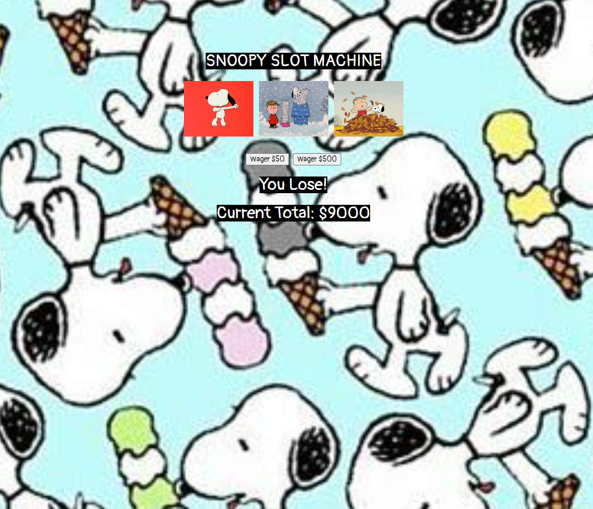

# Snoopy Slot Machine Project

Link to project: https://sillyslotmachine.netlify.app/

## How It's Made:
Tech used: HTML, CSS, JS

A simple slot machine application that starts the user off with a set amount of money in their bank. Users can click a button to either wager $50 or $500. If they win, they receive 5x their wager. If they lose, they lose their wager. 

The application utilizes Math.random to pull one of five images from an array of images. If the image matches in all three slots, the user wins!

## Optimizations

I went ahead and made one wager function that accepts an argument - by doing this, I was able to avoid writing redundant code and recall the same function for the different wager amounts.

## Lessons Learned

I learned the importance of having unique functions for each specific action when making this application. If something broke during implementation, I was able to go back and pinpoint the exact funtion that caused the application to break, since all of the moving parts were encapsulated into their own unique functions.

